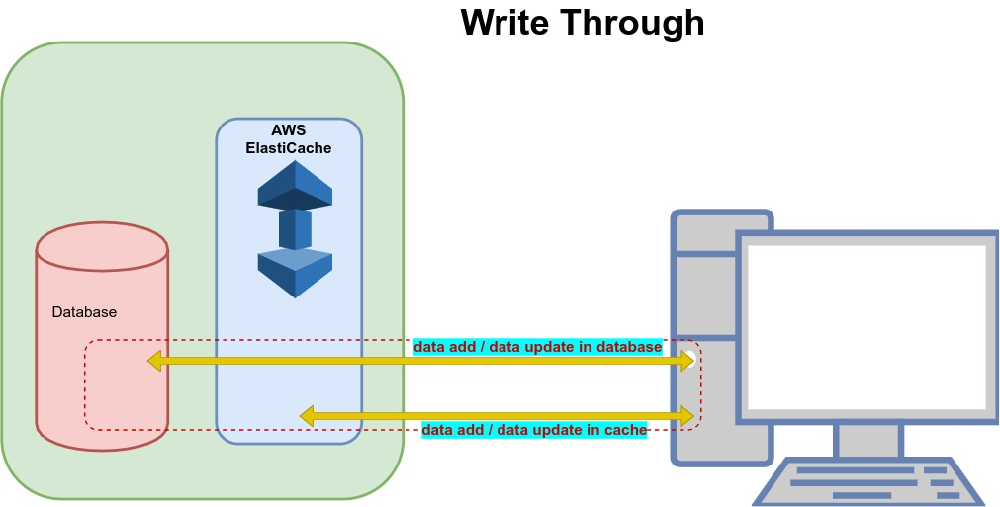

# AWS ElastiCache

---

## Overview

ElastiCache is a distributed cache environment for providing faster access to data by using cloud-based caching. Querying for data directly from databases or through remote API calls is much slower than querying the data from cache. AWS provides ElastiCache service which has high performance, scalability and cost-effectiveness. It removes the complexities associated with managing a distributed cache.

### Use Cases for ElastiCache

Below are some of the use cases which leverage ElastiCache for fastness in querying in a cost-effective manner.

1. **Real-time analytics** -When customers do online shopping, the recommendation of products have to generated instantly when the customer is still browsing the catalogue. This needs the existing products already chosen by the customer to be stored in the cache and analysed in real time for recommending the next set of products.

2. **Message Management** -When the message is sent to subscribers through some channels, there is always a flux of some subscribers cancelling their subscription and some other joining the specific channel. Without caching mechanism there is a chance of messages getting missed or misplaced due to delay. So ElastiCache helps in maintain the subscription status current and accurate.

3. **Leader boards** -In the gaming industry there is a constant update on the points scored by the gamers and their position in the leader board. This needs continuous update and caching is very much needed here to be able to display the changing leadership positions continuously.

## ElastiCache Content

Everything can not be and need not be cached. So, the various factors that influence what kind of content need to be cached are discussed below.


## Components of ElastiCache

The ElastiCache provisioned by AWS has the following important components.

1. **Node** - A node is a fixed-size chunk of secure, network-attached RAM. Each cache node has its own Domain Name Service (DNS) name and port.

2. **ElastiCache for Redis Shards** – It is a group of one to six related nodes. A cluster can have one to 90 shards.

3. **ElastiCache for Redis Clusters** - A Redis cluster is a logical grouping of one or more ElastiCache for Redis Shards. Data is partitioned across the shards in a Redis (cluster mode enabled) cluster.

4. **ElastiCache for Redis Endpoints** – It is a unique address your application uses to connect to an ElastiCache node or cluster.

   

---

## Redis Cluster

A **Redis cluster** is a logical grouping of one or more ElastiCache shards. Data is partitioned across the shards in a Redis cluster. But you can also run Redis with the cluster mode enabled or disabled. With cluster mode disabled, we call it a standalone Redis cluster. With cluster mode enabled, it is called Redis cluster with multiple shards.

---

## Redis Shards

A shard is a collection of one or more nodes in an ElastiCache cluster. It is created to support replication of data into various nodes in the ElastiCache cluster so that cache remains reachable in case of loss of few nodes. Depending on how the cluster mode is configured, a Redis cluster can have one or more shards. If the cluster mode is disabled, then the Redis cluster will have only one shard.

```
A shard = Primary Node + Read Replicas
```

> **Primary Node**

One of the nodes in a shard is designated as a primary node. Applications can write only to the primary node. Data written to the primary are asynchronously propagated to all the read replicas. An existing primary node can exchange its role with one of the read replicas for better performance.

> **Read Replicas**

Read replica maintains a copy of the data from the cluster's primary node. Read replicas improve read throughput and guard against data loss in cases of a node failure. Applications can read from any node in the cluster whether read replica or primary node.

---

## **Disabled** Cluster Mode

In this mode we create a Redis cluster in which there is only one shard which contains all the Redis nodes. One of the nodes is designated as primary node and others are called read-only replica nodes.


Following are the features of a Redis cluster in which the cluster mode is disabled.

- All the nodes in a Redis (cluster mode disabled) cluster must reside in the same region. To improve fault tolerance, you can provision read replicas in multiple Availability Zones within that region.

- When you add a read replica to a cluster, all the data from the primary is copied to the new node. From that point on, whenever data is written to the primary, the changes are asynchronously propagated to all the read replicas.

- Use Redis (cluster mode disabled) clusters with replica nodes to scale your Redis solution for ElastiCache to handle applications that are read-intensive.

## Cluster Mode **Enabled**

In this mode we create a Redis cluster in which there are 1 to 90 shards. Each shard has a primary node and up to five read-only replica nodes. Each read replica in a shard maintains a copy of the data from the shard's primary node.


Following are the features of a Redis cluster in which the cluster mode is disabled.

- Asynchronous replication mechanisms are used to keep the read replicas synchronized with the primary. Applications can read from any node in the cluster. Applications can write only to the primary nodes.

- All of the nodes in this Redis cluster must reside in the same region.

- You cannot manually promote any of the replica nodes to primary.

- You can only change the structure of a cluster, the node type, and the number of nodes by restoring from a backup.

---

## AWS ElastiCache - Memcached and Redis

Amazon ElastiCache supports the Redis and Memcached cache engines. Redis is an open-source in-memory data structure implementing a distributed, in-memory key-value database. Memcached is also a distributed memory caching system. It is often used to speed up dynamic database-driven websites by caching data and objects to reduce the number of times an external data source must be read to get the values in to the web application.

### Using Redis

The below list of features show how Redis is capable of handling more complex data structures, provide persistence and sorting etc. So the scenarios under which we should favour Redis as the platform in ElastiCache are .....

- Need to store complex data types, such as strings, hashes, lists, sets, sorted sets, and bitmaps.
- Need to sort or rank in-memory datasets.
- Need persistence of your key store.
- Need to replicate your data from the primary to one or more read replicas for read intensive applications.
- Need automatic failover if your primary node fails.
- Need backup and restore capabilities.
- Need to support multiple databases.

### Using Memcached

Memcached is more suitable for simpler data structures and does not provide persistence. So the below scenarios are appropriate for Memcached use.

- Need the simplest data model possible to store Key-Value pairs.
- Need to run large nodes with multiple cores or threads
- Need the ability to scale out and in, adding and removing nodes as demand on your system increases and decreases.
- Need to cache objects, such as a database.

---

## Caching Strategies

There are different ways to populate the cache and keep maintaining the cache. These different ways are known as caching strategies.

1. Lazy Loading
2. Write Through
3. Add TTL

### 1. AWS ElastiCache - Lazy Loading

When data is requested by the application, the request searches for data in the cache of ElastiCache. There are two possibilities. Either the data exists in the cache or it does not. Accordingly we classify the situation in to following two categories.

> **Cache Hit**

- The application requests the data from Cache.
- The cache query finds that updated data is available in the cache.
- The result is returned to the requesting application.

> **Cache Miss**

- The application requests the data from Cache.
- The cache query finds that updated data is not available in the cache.
- A null is returned by cache query to the requesting application.
- Now the application requests the data directly from the database and receives it.
- The requesting application then updates the cache with the new data it received directly from the database.
- Next time the same data is requested, it will fall into cache hit scenario above.

The above scenarios can be generally depicted by the below diagram.


#### Advantages of Lazy Loading

1. **Only requested data is cached**-Since most data is never requested, lazy loading avoids filling up the cache with data that isn't requested.

2. **Node failures are not fatal**-When a node fails and is replaced by a new, empty node the application continues to function, though with increased latency. As requests are made to the new node each cache miss results in a query of the database and adding the data copy to the cache so that subsequent requests are retrieved from the cache.

#### Disadvantages of Lazy Loading

1. **Cache miss penalty**-Each cache miss results in 3 trips. One, Initial request for data from the cache, two, query of the database for the data and finally writing the data to the cache. This can cause a noticeable delay in data getting to the application.

2. **Stale(or not latest) data** -If data is only written to the cache when there is a cache miss, data in the cache can become stale since there are no updates to the cache when data is changed in the database. This issue is addressed by the Write Through and Adding TTL strategies.

### 2. AWS ElastiCache - Write Through

Like lazy loading, write through is another caching strategy but unlike lazy loading, it does not wait for a hit or miss. It is a straight forward strategy in which the syncing between cache and database happens as soon as some data is written into the database.

It can be easily understood from the below diagram.



#### Advantages of Write Through

1. **Data in the cache is never stale** -Since the data in the cache is updated every time it is written to the database, the data in the cache is always current.

2. **Write penalty vs. Read penalty** - Every write involves two trips, a write to the cache and a write to the database. This adds latency to the process. That said, end users are generally more tolerant of latency when updating data than when retrieving data. There is an inherent sense that updates are more work and thus take longer.

#### Disadvantages of Write Through

1. **Missing data** –In the case of spinning up a new node, whether due to a node failure or scaling out, there is missing data which continues to be missing until it is added or updated on the database. This can be minimized by implementing Lazy Loading in conjunction with Write Through.

2. **Cache churn** -Since most data is never read, there can be a lot of data in the cluster that is never read. This is a waste of resources. By Adding TTL you can minimize wasted space.

### 3. AWS ElastiCache - Add TTL

TTL is also known as Time to live. It is used to take advantage of both the lazy load strategy as well as write through strategy.

Write through ensures that data is always fresh but may fail with empty nodes and may populate the cache with superfluous/un-necessary data. By adding a time to live (TTL) value to each write, we are able to get the advantages of each strategy and largely avoid cluttering up the cache with superfluous data.

> **How TTL Works**

Time to live (TTL) is an integer value that specifies the number of seconds until the key expires. When an application attempts to read an expired key, it is treated as though the key is not found, meaning that the database is queried for the key and the cache is updated.

This does not guarantee that a value is not stale(or not latest), but it keeps data from getting too stale and requires that values in the cache are occasionally refreshed from the database.

> **TTL Example**

The below code gives an example of how TTL is implemented by using a function.

```
async function save_customer(customer_id, values) {

    customer_record = await db.query("UPDATE Customers WHERE id = {0}", customer_id, values)
    cache.setex(customer_id, customer_record, 300)

    return success
}
```

Code for Lazy Load Strategy

```
async function get_customer(customer_id) {

    customer_record = cache.get(customer_id)

    if (customer_record !== null) {
      return customer_record        // return the record and exit function
    }

    // do this only if the record did not exist in the cache OR the record in the cache had expired.
    customer_record = db.query("SELECT * FROM Customers WHERE id = {0}", customer_id)
    cache.setex(customer_id, customer_record, 300)  // update the cache
    return customer_record
}
```

## Pricing

Get started with Amazon ElastiCache for Free

Pay only for what you use. There is no minimum fee. Estimate your monthly bill using the [AWS Simple Monthly Calculator](http://calculator.s3.amazonaws.com/calc5.html).

On-Demand Nodes let you pay for memory capacity by the hour your node runs with no long-term commitments. This frees you from the costs and complexities of planning, purchasing, and maintaining hardware and transforms what are commonly large fixed costs into much smaller variable costs.

_**Pricing is per node-hour consumed, from the time a node is launched until it is terminated. Each partial node-hour consumed will be billed as a full hour.**_

---

## How to run the application locally.

You must have docker installed on your machine and then simple run the below command

```
docker-compose up --build
```
